# Module 3 Final Project

## Outline
-----------------------------------------
    ├── LICENSE
    ├── README.md                  <- The project layout (this file)
    ├── zippedData                 <- This is where the project data is located
    │
    ├── student.ipynb              <- This is the main notebook (contains the python code)
    │
    ├── reports                    <- Reports and presentations
    │   └── presentation.pdf       <- Non-technical presentation
    │
    ├── images                     <- Where the graphs are saved
    ├── requirements.txt           <- The requirements file for reproducing the analysis environment

## Conclusion

### Does the source of water affect the likelihood for needing repairs?

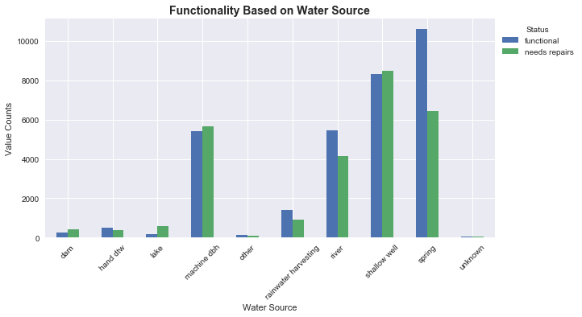

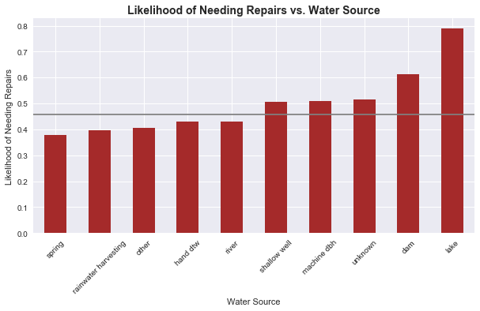

According to the above Likelihood of Needing Repairs vs. Water Source bar graph, the water sources that increase the likelihood for needing repairs above the average are, in ascending order: Shallow wells, Machine dbh, Unknown, Dam, and Lakes. 

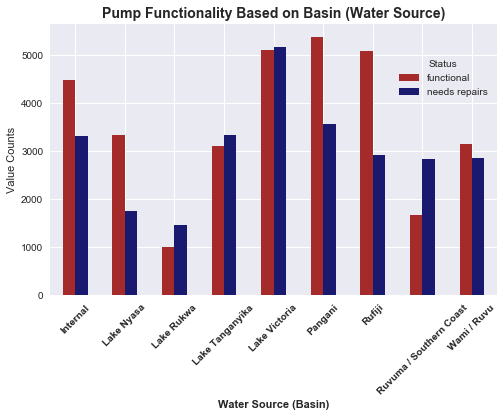

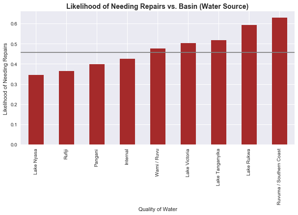

Based on the Likelihood of Needing Repairs vs. Basin bar graph, the bodies of water that increase the likelihood for needing repairs above the average are, in ascending order: Wami/Ruvu, Lake Victoria, Lake Tanganyika, Lake Rukwa, and Ruvuvuma/Southern Coast.

### Does the region affect the likelihood for needing repairs?

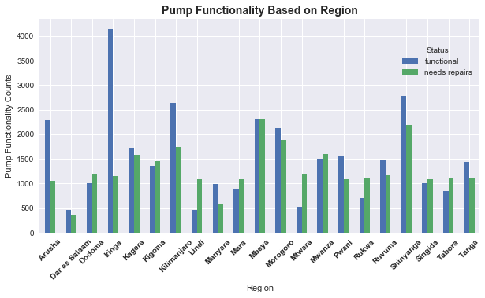

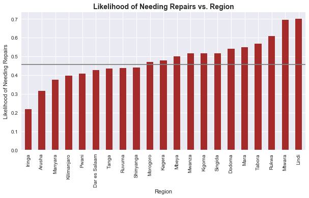

Based on the Likelihood of Needing Repairs vs. Region bar graph, the regions that increase the likelihood of needing repairs above the average, in ascending order, are: Morogoro, Kagera, Mbeya, Mwanza, Kigoma, Singida, Dodoma, Mara, Tabora, Rukwa, Mtwara, and Lindi. 

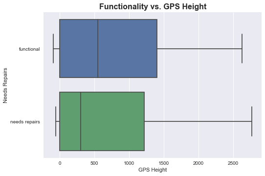

Based on the Functionality vs. GPS Height boxplot, as the GPS height increases, the wells are less likely to need repairs.

### Do public meetings regarding the state of a pump affect its outcome in regards to needing repairs?

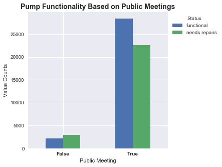

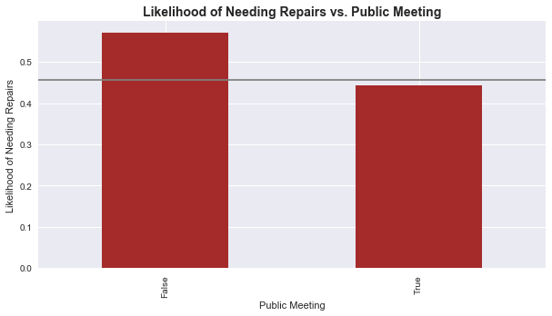

According to the Functionality Based on Public Meetings bar graph, most wells do have public meetings. Furthermore, according to the Likelihood of Needing Repairs vs. Public Meeting bar graph, public meetings lower the likelihood for needing repairs for their associated wells.

### What are some other factors that influence the need for repairs?

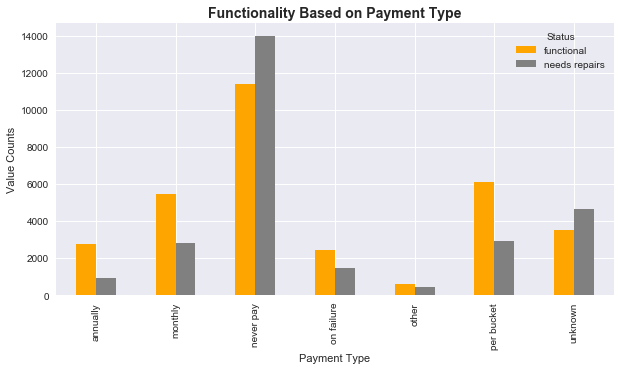

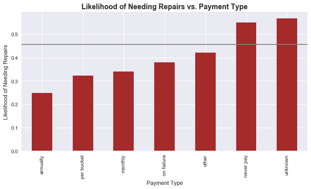

According to the Likelihood of Needing Repairs vs. Payment Type bar graph, payment types of unknown and never pay are ones with a higher than average likelihood of needing repairs. 

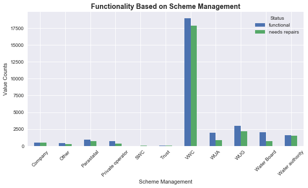

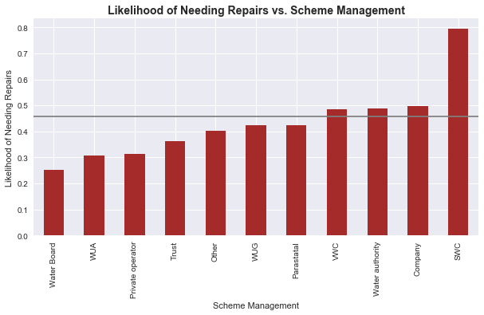

According to the Likelihood of Needing Repairs vs. Scheme Management bar graph, the likelihood of needing repairs increases substantially when the well is managed by SWC (Soil Water Conservation).  

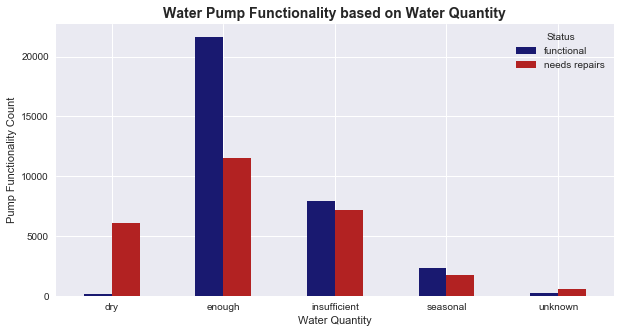

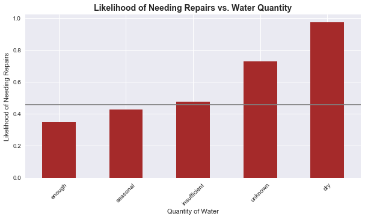

According to the Likelihood of Needing Repairs vs. Water Quantity bar graph, when the quantity of water is insufficient, unknown, or dry, the likelihood of needing repairs is above average. 

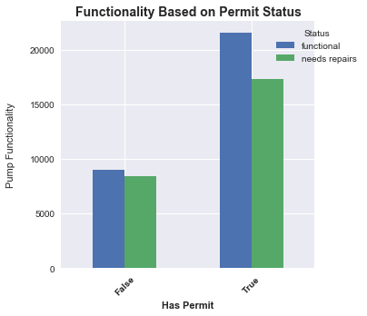

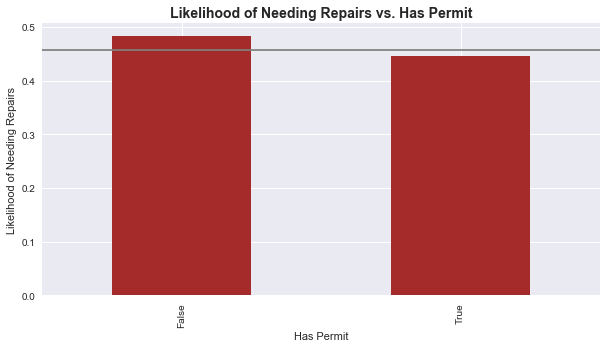

According to the Likelihood of Needing Repairs vs. Permit Status bar graph, wells that have a permit are less likely to need repairs than wells that do not have a permit.

According to the Functionality vs. Age of Well box plot, the wells that need repair have an age range and average age that is higher than wells that do not need repairs.

## Modeling:

To try different classification models in order to allow the user (e.g. the Tanzanian Ministry of Water) to attempt to identify which pumps are in need of repairs (whether functional or not) based on data that includes multiple features, such as: the quality of water provided by the pump, quantity of water, funding source, whether public meetings take place to discuss the status of these pumps, etc... This would allow the user (such as the Tanzanian Ministry of Water) to make predictions on which water delivery systems are experiencing mechanical issues and proactively attempt to repair them, thus maintaining the availability of potable water.

Our dataset contains information about 59,400 Tanzanian water pumps. There are 40 attributes (some of which are purely administrative) that could potentially be predictor variables. These attributes are either administrative variables, categorical variables, or non-categorical numerical variables. The response variable is: are the wells fully functional (negative class), or are they in need of repairs (positive class).

The following attributes were used in our models: GPS Height, Installer, Basin, Region, District Code, Ward, Public Meeting, Scheme Management, Permit, Extraction Type Group, Management, Management Group, Payment, Water Quality, Quality Group, Quantity, Source, Source Class, Waterpoint Type, Population Bin, and Age of Well. Therefore, 21 attributes, of the 40 available, were used in the models.

The following models were used: Linear SVC, XGBoost, and Random Forest. The model that worked best was XGBoost, and it provided the following metrics:

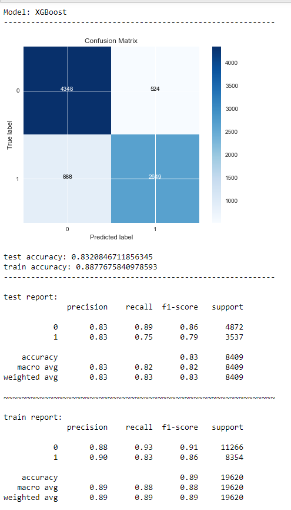

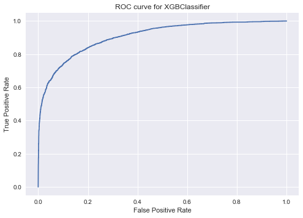

Parameters that provided the best XGBoost model:

{'model__colsample_bytree': 1.0,
 'model__eta': 0.3,
 'model__max_depth': 10,
 'model__min_child_weight': 6,
 'model__subsample': 0.8}

## Recommendations

As shown above, there are many factors that are associated with an increase in likelihood of needing repairs for wells in Tanzania. Therefore, this would allow the user (such as the Tanzanian Ministry of Water) to make predictions on which water delivery systems are experiencing mechanical issues and proactively attempt to repair them, thus maintaining the availability of potable water. 

When trying to look for wells that are more likely to experience mechanical issues or failure, the user should look at the water source, the basin, the region, the gps height, whether or not public meetings are associated with it, the payment type, scheme management, whether it have a valid permit, the water quantity, and the age of well. The above graphs should be referenced in order to find the specific values to look for in each of those attributes.
